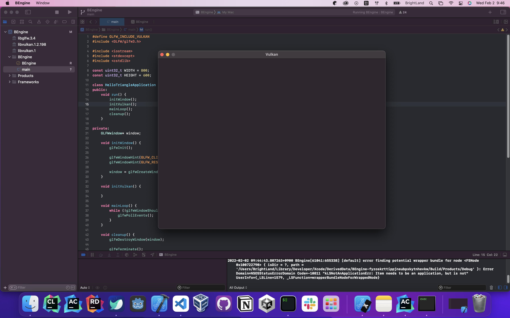

#01 BaseCode 정리
원본: [Vulkan Tutotial Page](https://vulkan-tutorial.com/Drawing_a_triangle/Setup/Base_code, "vulkan link")
###실행 화면
   

##Vulkan 의 일반 구조
```cpp
#include <vulkan/vulkan.h>

#include <iostream>
#include <stdexcept>
#include <cstdlib>

class HelloTriangleApplication {
public:
    void run() {
        initVulkan();
        mainLoop();
        cleanup();
    }

private:
    void initVulkan() {

    }

    void mainLoop() {

    }

    void cleanup() {

    }
};

int main() {
    HelloTriangleApplication app;

    try {
        app.run();
    } catch (const std::exception& e) {
        std::cerr << e.what() << std::endl;
        return EXIT_FAILURE;
    }

    return EXIT_SUCCESS;
}
```

##GLFW 통합 (window(OS 아님)를 통한 실습환경 구축)
사실 윈도우 창이 없어도, 정상 작동을 한다.   
하지만 실제로 보면서 하는 편이 더 낫기 때문에 실습 환경을 구축하는 것이다.   
그러므로 아래 내용을 따르자.   
먼저 ```#include <vulkan/vulkan.h>```를 아래 내용으로 바꾸어 주자.   
```c++
#define GLFW_INCLUDE_VULKAN
#include <GLFW/glfw3.h>
```
***
Vulkan을 자동 적재하고, 자체 정의 또한 포함하는 GLFW를 사용할 수 있게 되었다.     
이제 ```initWindow```를 헤더 부분에 넣고 (지금은 private 부분), ```run```의 가장 위에 두어서   
가장 먼저 호출될 수 있도록 하자.   
```c++
void run() {
    initWindow();
    initVulkan();
    mainLoop();
    cleanup();
}

private:
    void initWindow() {
    
    }
```
***
```initWindow``` 내에서 가장 먼저 호출될 것은 ```glfwInit()```로, GLFW 라이브러리를 초기화하는 일을 한다.   
하지만 본래 GLFW는 openGL용으로 디자인되었기 때문에, 우리는 openGL로 생성되지 않게 아래 함수를 사용해야 한다.   
```c++
glfwWindowHint(GLFW_CLIENT_API, GLFW_NO_API);
```
***
사이즈가 조절된 window는 취급시 특별 주의가 필요하기 때문에 우리는 이 부분을 다음에 보기로 하고,   
지금은 다른 Window 호출을 통해 비활성화 시켜주자.   
```c++
glfwWindowHint(GLFW_RESIZABLE, GLFW_FALSE);
```
***
이제 남은 것은 실제 창을 만드는 일 뿐이다. ```GLFWwindow* window;```를 private class 멤버로 만들어 두자.   
그리고 window를 초기화하는 방법은 이렇다.   
```c++
// 처음 세 개의 매개 변수는 창의 너비, 높이 그리고 제목을 뜻한다.
// 네번째 매개 변수를 사용하면 모니터를 선택적으로 창을 열 수 있는 모니터를 허락한다.
// 마지막 파라미터는 openGL에만 해당된다.. (궁금해)
window = glfwCreateWindow(800, 600, "Vulkan", nullptr, nullptr);
```
***

이제 우리의 ```initWindow``` 함수는 이렇게 생겼을 것이다.   
```c++
void initWindow() {
    glfwInit();

    glfwWindowHint(GLFW_CLIENT_API, GLFW_NO_API);
    glfwWindowHint(GLFW_RESIZABLE, GLFW_FALSE);

    window = glfwCreateWindow(WIDTH, HEIGHT, "Vulkan", nullptr, nullptr);
}
```
***

우리는 ```mainLoop``` 함수를 통해 프로그램을 error가 발생하거나, window를 닫지 않는 이상 계속 돌릴 수 있다.   
```c++
void mainLoop() {
    while (!glfwWindowShouldClose(window)) {
        glfwPollEvents();
    }
}
```
***
이 코드는 중요하다. 프로그램을 닫는 이벤트(예를 들면 x버튼을 유저가 누른다던가)를 반복하고 확인한다.   
또한 단일 프레임을 렌더링할 때(Late call)도 반복한다.   
window가 닫히면, 우리는 자원을 정리하고 GLFW를 자체 종료시켜야 한다.   
이것이 우리의 첫번째 ````cleanup```` 코드이다.
```c++
void cleanup() {
    glfwDestroyWindow(window);

    glfwTerminate();
}
```
***

이제 프로그램을 실행시켜보자! ```Vulkan```이라는 제목(만약 다른 걸로 바꿨다면 그거)의 프로그램이 실행될 것이다!      
우리가 닫기 전까지는 계속 켜져 있는 것을 볼 수 있을 것이다.      
우리는 이제 Vulkan의 뼈대를 만들 것이다..!  
[Vulkan 오브젝트 만들러 가기](/02_Instance.md, "instance")
