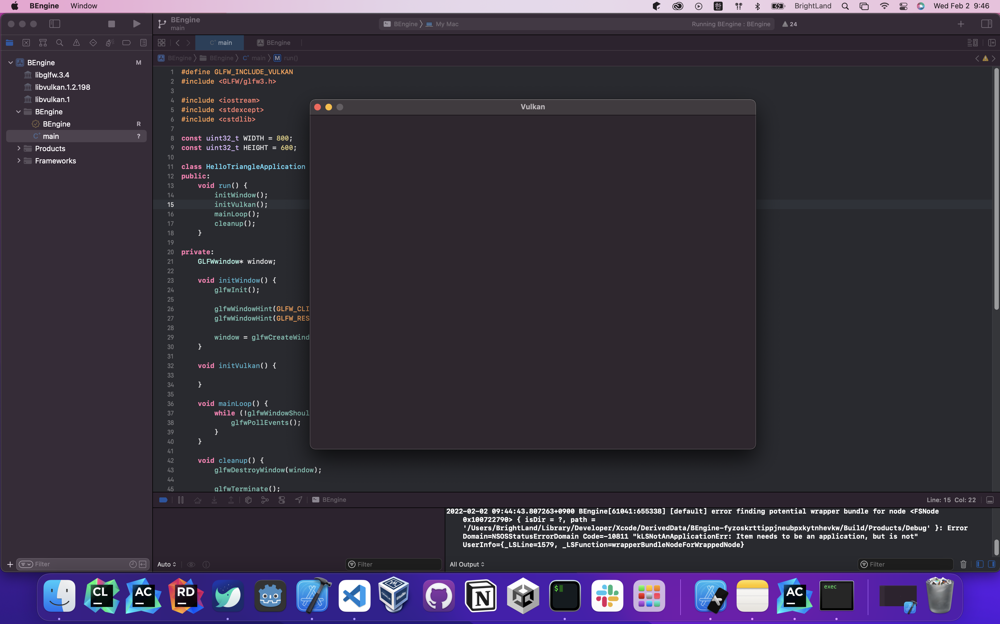

# Instance
***   
>- Creating an instance
>- Checking for extension support
>- Cleaning up      

원본: [Vulkan Tutotial Page](https://vulkan-tutorial.com/Drawing_a_triangle/Setup/Insatnce "vulkan link")
### 실행 화면
    
***

#Creating an instance
> 인스턴스 만들기 

우리가 해야할 가장 첫번째는 *인스턴스*를 만듦으로써 Vulkan 라이브러리를 초기화하는 것이다.   
인스턴스는 우리의 어플리케이션과 Vulkan 라이브러리, 그리고 어플리케이션의 각 세부 사항들을 포함한 드라이버를 만든다.   

`createInstance` 함수를 `initVulkan`함수 내에 추가하자.   
```c++
void initVulkan() {
    createInstance();
}
```
추가로 인스턴스를 조작할 데이터 멤버를 추가하자. 
```c++
private:
VkInstance instance;
```
이제, 


